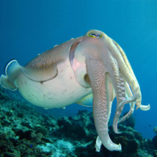

# Questions & Answers

## What is Metasepi?

Challenge to create a free software Unix-like operating system written with type system.

Photo: [Copyright (C) 2007 Silke Baron All Rights Reserved](http://www.flickr.com/photos/silkebaron/931247866/).

## What is Arafura?

Initial code name of a Metasepi design.
And you know where [Metasepia pfefferi](http://en.wikipedia.org/wiki/Metasepia_pfefferi) live in.

