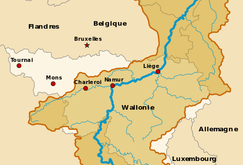
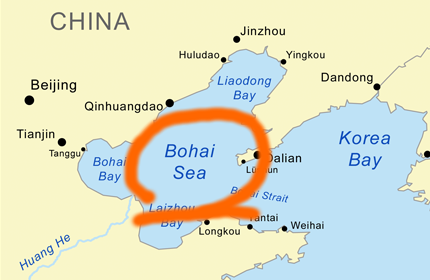
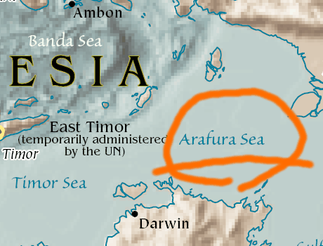

# Questions & Answers

## What is Metasepi?

Challenge to create a free software Unix-like operating system designed with strong type.

Photo: [Copyright (C) 2007 Silke Baron All Rights Reserved](http://www.flickr.com/photos/silkebaron/931247866/).

## How do you get it?

Use [iterative development](http://en.wikipedia.org/wiki/Iterative_and_incremental_development).
First, we choose language and development method as design, then develop OS for testing with the design.
Finally, study the actual results before closing the iteration.

## What is Doushi design?

4th code name of a Metasepi's design.
And it's a river which runs with the hometown of [Laid-Back Camp](https://en.wikipedia.org/wiki/Laid-Back_Camp).
Detail of Danvers design is found at [Map page](map.html#doshi).

## What is Chiers design?

3rd code name of a Metasepi's design.
And it's a river which runs at home of [Bart Jacobs](https://distrinet.cs.kuleuven.be/people/bartj) as the author of [VeriFast verifier](https://people.cs.kuleuven.be/~bart.jacobs/verifast/).
Detail of Chiers design is found at [Map page](map.html#chiers).

## What is Bohai design?

2nd code name of a Metasepi's design.
And it's a sea on home of [Hongwei Xi](http://www.cs.bu.edu/~hwxi/) as the author of [ATS Programming Language](http://www.ats-lang.org/).
Detail of Bohai design is found at [Map page](map.html#bohai).

## What is Arafura design?

Initial code name of a Metasepi's design.
And you know where [Metasepia pfefferi](http://en.wikipedia.org/wiki/Metasepia_pfefferi) live in.
Detail of Arafura design is found at [Map page](map.html#arafura).

